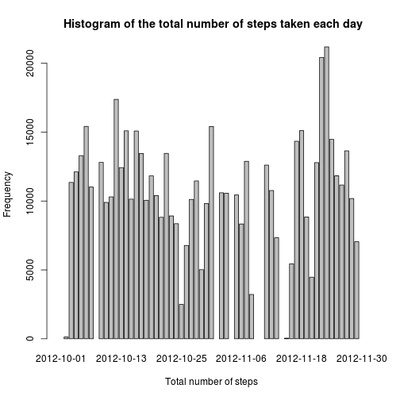

## Loading and preprocessing the data

```r
#setwd('Documents/Coursera/ReproducibleResearch/RepData_PeerAssessment1/')
data <- read.csv('activity.csv')
data$date<- as.Date(data$date,format='%Y-%m-%d')
```
## What is mean total number of steps taken per day?

```r
require(plyr)
sums=ddply(data,.(date),summarise,sums=sum(steps))$sums
dailyStep <- data.frame(date=unique(data$date),totalDailySteps=sums)
hist(dailyStep$totalDailySteps,ylab = 'Frequency',xlab = 'Total number of steps', main = ' Histogram of the total number of steps taken each day
')
```

 

```r
totalsmean <- mean(dailyStep[! is.na(dailyStep$totalDailySteps),"totalDailySteps"])
totalsmedian <- median(dailyStep[! is.na(dailyStep$totalDailySteps),"totalDailySteps"])
```
the mean total number of steps taken per day is 1.0766189 &times; 10<sup>4</sup> and 
the median total number of steps taken per day is 10765
## What is the average daily activity pattern?

```r
require(plyr)
#remove NA values
averages<- ddply(data[! is.na(data$steps),], .(interval),summarise,averages=mean(steps))$averages
timedData<- data.frame(interval=unique(data[! is.na(data$steps),'interval']),stepsAverage=averages)
plot(timedData$interval ,timedData$stepsAverage,ylab = 'time interval',xlab ='steps average',type = 'l',col='black')
```

 

```r
#timedSums=ddply(data[! is.na(data$steps),],.(interval),summarise,sums=sum(steps))
maxSteps=timedData[which.max(timedData[,"stepsAverage"]),"interval"]
```
The interval containing the maximum is the 835
## Imputing missing values

```r
n_NAs = nrow(data[is.na(data$step),])
```
The number of missing values is 2304

```r
newData<-data
for(row in 1:nrow(data)) { 
  if(is.na(data[row,'steps'])){
      newData[row,'steps'] <- timedData[match(data[row,'interval'],timedData$interval),'stepsAverage']
    }
}
require(plyr)
newSums=ddply(newData,.(date),summarise,sums=sum(steps))$sums
newDailyStep <- data.frame(date=unique(newData$date),totalDailySteps=newSums)
hist(newDailyStep$totalDailySteps,ylab = 'Frequency',xlab = 'Total number of steps', main = ' Histogram of the total number of steps taken each day
')
```

 

```r
newTotalsmean <- mean(newDailyStep$totalDailySteps)
newTotalsmedian <- median(newDailyStep$totalDailySteps)
```
From the new data the the mean and median total number of steps taken per day are: 1.0766189 &times; 10<sup>4</sup> and 1.0766189 &times; 10<sup>4</sup>

## Are there differences in activity patterns between weekdays and weekends?

```r
f<-function(x){result<-if(weekdays(x)=="dimanche" | weekdays(x)=="samedi")"weekend"else"weekday"}
newData$weekday=sapply(newData$date,f)

averages1<- ddply(newData[newData$weekday=="weekday",], .(interval),summarise,averages=mean(steps))$averages
averages2<- ddply(newData[newData$weekday=="weekend",], .(interval),summarise,averages=mean(steps))$averages

timedData1<- data.frame(interval=unique(newData[newData$weekday=="weekday",'interval']),stepsAverage=averages1)
timedData2<- data.frame(interval=unique(newData[newData$weekday=="weekend",'interval']),stepsAverage=averages2)

par(mfrow = c(2, 1))
plot(timedData1$interval ,timedData1$stepsAverage,type = 'l',col='blue')
plot(timedData2$interval ,timedData2$stepsAverage,type = 'l',col='blue')
```

 
